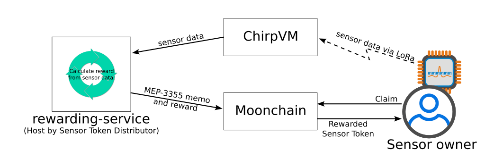

# Example of ISO Sensor Token and Rewarding Service

This is the an example project of ISO Sensor Token and rewarding service.

The contract is following the UUPS pattern for the upgrade ability. Contract implementation and Storage are using Inherited approach.

Please reference to this example when modify for upgrade.

https://github.com/MehdizadeMilad/sample-uups-proxy-upgrade-able-smart-contracts


## Tested development environment

- Ubuntu 22.04

- nodejs v18.18.2

- npm 9.8.1

- yarn 1.22.22


## Development

After clone the repos, run this once to install the npm packages.

```
yarn
```


Compile solidity and generate types

```
npx hardhat compile
```


Test

```
npx hardhat test
```


If you changed the typia input files, run the following command once before compile.

```
yarn generate
```


## Deployment

Set the private key for deployment.

```
export DEPLOYER_KEY=<PRIVATE KEY>
```


Deploy a contract to testnet.

```
npx hardhat --network mxc_testnet run deploy/deploy_MEP804v1.ts
```

The proxy address will show after deploy.


Verify the deployed contract.

```
npx hardhat verify --network mxc_testnet <Proxy Address>
```

*You will got an "Etherscan API call failed with status 400." error when process the Proxy. You may ignore it as the contract are verified on Moonchain anyway.*


## Run script on testnet/mainnet

Set the private key for interaction.

```
export DEPLOYER_KEY=<PRIVATE KEY>
```


Set the Proxy address got from the deployment step above.

```
export PROXY_MEP801=<Proxy Address>
export PROXY_MEP802=<Proxy Address>
export PROXY_MEP803=<Proxy Address>
export PROXY_MEP804=<Proxy Address>
```


Run a script.

```
npx hardhat --network mxc_testnet run scripts/test_proxy.ts
```


## Rewarding Service

The rewarding service processes sensor data received from ChirpVM and calculates the corresponding reward. This data, along with the calculated reward, is then submitted to Moonchain, with the calculation typically occurring every few hours.

Once the reward is received, the sensor owner can claim their sensor tokens, usually doing so once a day or every few days.



In this example, the service gathers active sensor data from ChirpVM, which is sending temperature readings (`temp_0`). It then grants a sensor token to the sensor owner.


### Run the service

Set the private key for rewarding service.

```
export INDEXER_KEY=<PRIVATE KEY>
```


Set the Proxy address.

```
export PROXY_MEP801=<Proxy Address>
export PROXY_MEP802=<Proxy Address>
export PROXY_MEP803=<Proxy Address>
export PROXY_MEP804=<Proxy Address>
```


Set the ChirpVM API base URL

```
export CHIRPVM_API_URL=https://chirpvm.matchx.io/iso/api
```


Set Nodejs mode, "development" or "production".

```
export NODE_ENV=development
```


Set the Application Index.

```
export TARGET_APPLICATION_IDX=1
```


Run the rewarding service on mxc_testnet (geneva).

```
npx hardhat --network mxc_testnet run indexer/main.ts
```


## Appendix

Online brotli tool: https://facia.dev/tools/compress-decompress/brotli-decompress/

